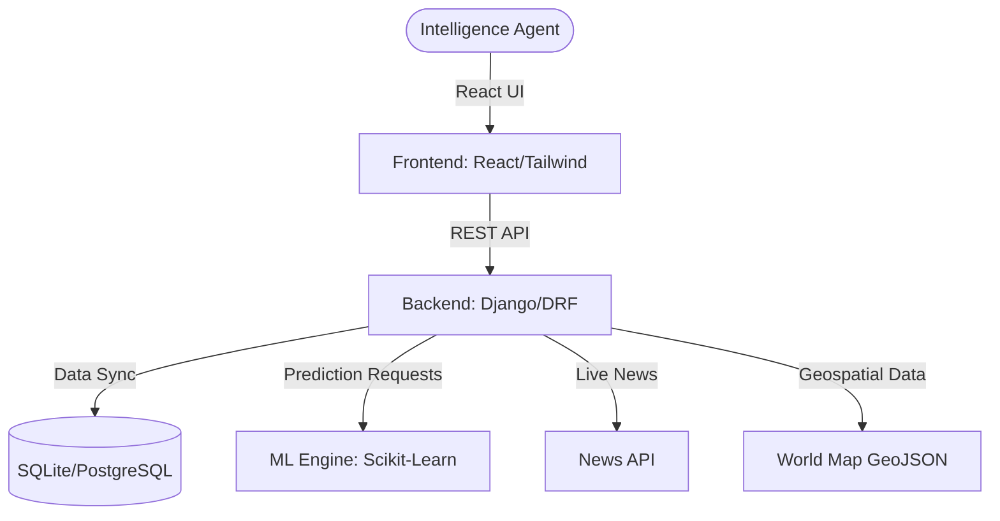

# System Architecture

## Overview
The Threat Intelligence platform is built on a modern distributed architecture, separating the concerns of data visualization, intelligence processing, and machine learning.

## Component Breakdown

### 1. Frontend (The "Tactical Interface")
- **Framework**: React 18
- **Styling**: Vanilla CSS + Tailwind for layout. Custom "Tactical" theme (Neon cyan on deep slate).
- **Visualization**:
    - `Globe.gl` / `Three.js`: High-end 3D world visualization.
    - `react-simple-maps`: 2D interactive maps for data density.
    - `Framer Motion`: Micro-animations for a "living" dashboard feel.
    - `Recharts`: Real-time data plotting for threat history.

### 2. Backend (The "Command Center")
- **Framework**: Django 5.0 + Django REST Framework.
- **Modules**:
    - `intel`: Core intelligence storage, alert management, and user preferences.
    - `accounts`: Identity management and agent authorization.
    - `agents`: Metadata and performance tracking for field agents.
    - `operations`: Mission planning and deployment status.
    - `comms`: Secure internal communication channels.

### 3. ML Engine (The "Predictor")
A dedicated Python module integrated with the Django lifecycle:
- **Core Strategy**: Logistic Regression and Random Forest models (Joblib) for threat scoring.
- **Capabilities**:
    - **Threat Predictor**: Inputs 15+ geopolitical features (GDP, Military Budget, Landmass) to output a 0-100 score.
    - **Anomaly Detector**: Identifies outliers in alert frequency using Isolation Forests.
    - **NLP Classifier**: Processes raw intel text to categorize and prioritize (Critical vs High vs Low).

## Data Flow
1. **Intel Ingestion**: News and reports are pulled from external APIs or manually entered.
2. **Analysis**: The ML engine processes the data to generate threat scores and classify risk levels.
3. **Distribution**: Data is exposed via a JWT-secured REST API.
4. **Visualization**: The frontend fetches data and renders it across 2D/3D maps and analytical panels.
